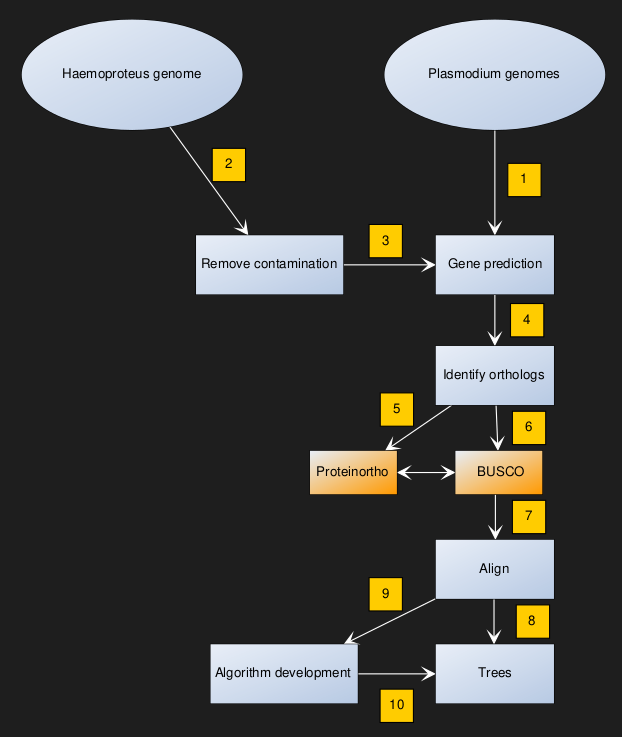
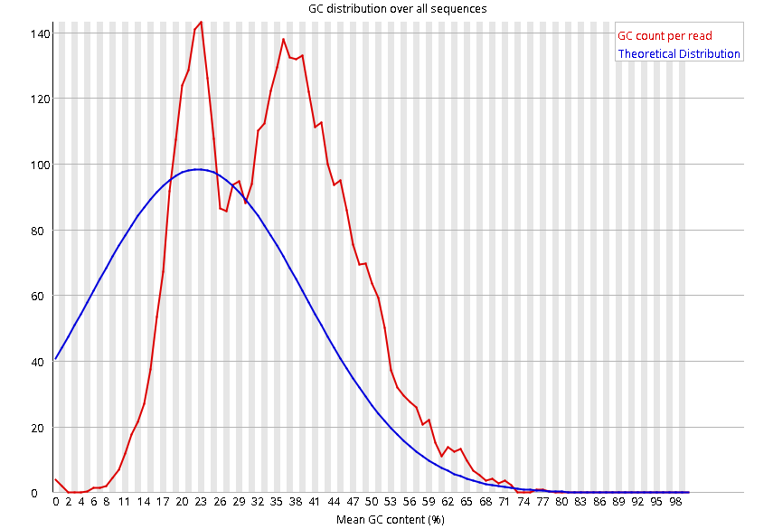
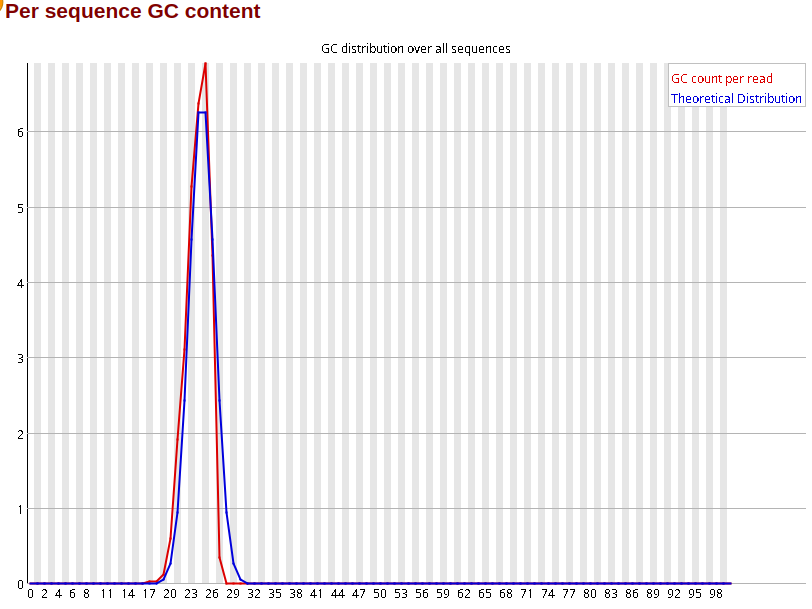
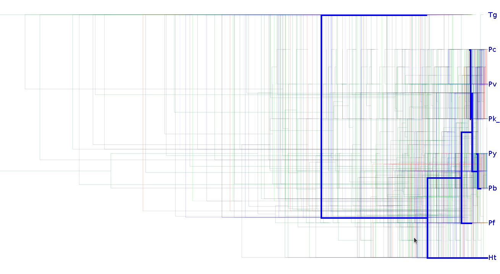

# Case Study: The Origin of Human Malaria

Malaria is caused by parasites belonging to the phylum *Apicomplexa*. One of the more well known genera causing malaria is *Plasmodium*. The species of this genus infect not only humans, but also other mammals, birds and reptiles. The single one species that causes most malaria infections in humans is *Plasmodium falciparum*. This is also the most serious of malaria infections. Many genomes of *Plasmodium* have been sequenced. Recently the first genome of an avian (bird) malaria parasite has been sequenced. The species' name is *Haemoproteus tartakovskyi*.

The genomes we will work with are:

|   | Species                                                              | Host     | Genome                                   |
| - | -------------------------------------------------------------------- | -------- | ---------------------------------------- |
| 1 | Plasmodium berghei                                                   | rodents  | Provided by the instructor on the server |
| 2 | Plasmodium cynomolgi                                                 | macaques | Provided by the instructor on the server |
| 3 | Plasmodium falciparum                                                | humans   | Provided by the instructor on the server |
| 4 | Plasmodium knowlesi                                                  | lemures  | Provided by the instructor on the server |
| 5 | Plasmodium vivax                                                     | humans   | Provided by the instructor on the server |
| 6 | Plasmodium yoelii                                                    | rodents  | Provided by the instructor on the server |
| 7 | [Haemoproteus](https://en.wikipedia.org/wiki/Haemoproteus) tartakovskyi | birds    | Provided by the instructor on the server |
| 8 | Toxoplasma gondii (outgroup)                                         | humans   | Provided by the instructor on the server |

## Research Questions


## Workflow

    

## Softwares

## 1 - Gene Prediction

### **1.1 Gene Pridiction for *Plasmodium* & *Toxoplasma* Species**

Gene prediction using GeneMark (the program name is `gmes_petap.pl` ) was performed on **Plasmodium** species' genomes. Since prediction takes time, Students were assigned one genome each, and the resulting gff-files were shared on the course server. The gff-file for Toxoplasma was downloaded from the course website under the name Tg.gff as it takes too long to run.

```

$ gmes_petap.pl --ES --sequence <seq.raw.genome>

# --ES : To run GeneMark-ES self-training algorithm
# --sequence : Input genome sequence

```

### 1.2 Gene Pridiction for *Haemoproteus tartakovskyi*

The *H. tartakovskyi* genome was sequenced by the 454 technology. Both shotgun and paired end sequencing were used. The scaffold file is found on the course server and has the name **Haemoproteus_tartakovskyi.genome**. Since the input reads *derive **both from the bird and the parasite, bird scaffolds should be removed***.



* GC% before removing bird scaffolds*

#### 1.2.1 Cleaning the *H. tartakovskyi* genome sequence

The GC content of *H. tartakovskyi* genome sequence is 26%. To remove scaffolds above this threshold and scaffolds that were less than 3000 nucleotides `01_Script/removeScaffold.py` was used.

```

# remove scaffolds GC>26 and len<3000
$mkdir 1_Ht_scaffoldRemoval
# python3 0_Data_Script/removeScaffold.py 0_Data_Script/Haemoproteus_tartakovskyi.raw.genome 26 1_Ht_scaffoldRemoval/Ht_gc26_3000.fa 3000

# This script accept four argument:
# [1] is input fasta file name
# [2] is threshold GC content as integer
# [3] is the output file
# [4] is the minimum length for scaffolds to keep

```

**1370 contigs remained**

We can examine the GC% after removal of birds scaffols

> Oneliner for multi line fasta to one line fasta
>
> ```
> awk '/^>/ {printf("%s%s\n",(N>0?"\n":""),$0);N++;next;} {printf("%s",$0);} END {printf("\n");}' htupper.fasta > htupper1.fasta
>
> ```
>
> Oneliner for convering fasta format to fastq
>
> ```
> $ cat H_tartakovskyi_remove.fasta | paste - - | perl -ne 'chomp; s/^>/@/; @v = split /\t/; printf("%s\n%s\n+\n%s\n", $v[0], $v[1], "B"x length($v[1]))' > fake.fastq
>
> ```
>
> Using fastqc for visualization
>
> ```
> $ fastqc fake.fastq 
> $ firefox fake_fastq.html
> ```



    GC% after removing bird scaffolds

#### 1.2.2 Gene Prediction

```
 
$ mkdir  2_Ht_GenePredict
$ cd 2_Ht_GenePredict
$ gmes_petap.pl --ES --sequence ../1_Ht_scaffoldRemoval/Ht_gc26_3000.fa --min_contig 7000


```

# convert to fasta


```

## header problem
cat genemark.gtf | sed "s/ GC=.*\tGeneMark.hmm/\tGeneMark.hmm/" > Ht2_header.gff
cd ..


```


```

# gff to fasta
mkdir 3_gtf2fasta
cd 3_gtf2fasta
perl ../0_Data_Script/gffParse.pl -i ../1_Ht_scaffoldRemoval/Ht_gc26_3000.fa -g ../2_Ht_GenePredict/Ht2_header.gff -c -p -b Ht -F
cd ..


```


> There were 1274 scaffolds containing genes.
> The scaffolds contained 2083 genes.
> The genes contained the feature CDS 6471 times.
> INFO: The scaffold/genome file ../1_Ht_scaffoldRemoval/Ht_gc26_3000.fa was successfully parsed.
> There were 1370 scaffolds. This number may be higher than the one above.
>


## Remove scaffolds that have genes that are from avian origin

```

mkdir 4_blast
cd 4_blast
nohup blastp -query ../3_gtf2fasta/Ht.faa -db SwissProt -evalue 1e-10 -out Ht_Swissprot.blastp -num_threads 10 &
cd ..

```


```

mkdir 5_scaff_rm_afterBlast
cd 5_scaff_rm_afterBlast
python3 ../0_Data_Script/datParser.py ../4_blast/Ht_backup_blast.blastout
 ../3_gtf2fasta/Ht.fna
 ../0_Data_Script/taxonomy.dat ../0_Data_Script/uniprot_sprot.dat > scaffoldsMine.txt


```


### remove similar scaffolds

```
python3 ../0_Data_Script/scaffoldCleaner.py scaffolds.txt
 ../3_gtf2fasta/Ht.fna new3.fasta
cd ..
```

# new gene predicttion

```
mkdir 6_newGPred
cd 6_newGPred
gmes_petap.pl --ES --sequence ../5_scaff_rm_afterBlast/new3.fasta
 --min_contig 5000 --cores 3
cd ..
gmes_petap.pl --ES --sequence ../5_scaff_rm_afterBlast/new_3_mine.fasta --min_contig 3000 --cores 10
```

# gff to fasta

```

mkdir 3_gtf2fasta
cd 3_gtf2fasta
perl ../0_Data_Script/gffParse.pl -i ../1_Ht_scaffoldRemoval/Ht_gc26_3000.fa
 -g ../2_Ht_GenePredict/Ht2_header.gff -c -p -b Ht -F
```

## proto

```
proteinortho6.pl ../7_gft2fasta_NEW/{Ht,Pb,Pc,Pf,Pk_rmScaff,Pv,Py,Tg}_new.faa
```

## busco

bash loop.sh


# Tree

)
